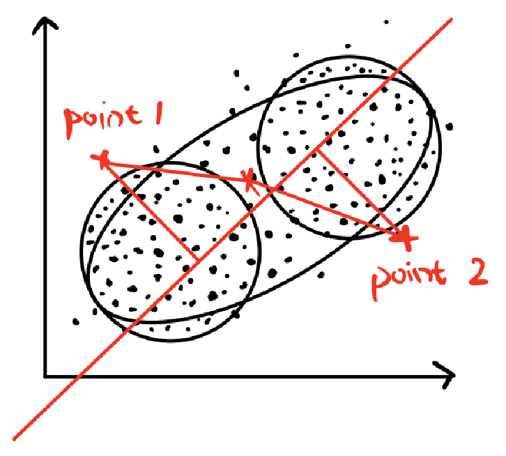

# Directional KMeans Classification

## Overview

The **Directional KMeans Classification** algorithm is an experimental approach designed to address a specific classification challenge, where traditional machine learning algorithms may fail to classify data according to a desired direction. This algorithm removes certain observations based on the direction of the data and applies KMeans clustering to the remaining data points. 

It is important to note that this algorithm was developed early in my statistical learning journey and may contain some conceptual issues, including forced or overly tailored solutions. Nonetheless, it serves as a learning experiment for understanding clustering and classification.

## Algorithm

### Motivation

Traditional machine learning algorithms often struggle to classify data based on a specified direction derived from prior knowledge. For instance, in a two-dimensional case with two normal distributions (A and B, where B has a larger mean than A), we might aim to classify data into two categories: one that is high on the x-axis and low on the y-axis, and another that is low on the x-axis and high on the y-axis.

However, traditional methods might produce undesired results. As shown below, the black line represents the classification boundary of a traditional method, while the red line represents our expected classification results.


*双变量正态分布*

*黑线表示传统机器学习的分类结果，红线表示我们的预期分类结果*

### Method

We experimented with multiple approaches to address this issue, all based on KMeans clustering. Below are some key approaches we attempted:

#### First Attempted Approach

We first changed the initial points selection strategy in traditional KMeans. We selected two points with the largest differences between the two variables as the starting points. We calculated the distance of each point to these two starting points and computed the weight for each point based on these distances.


*第一次尝试方法*

#### Second Attempted Approach

In the second approach, we assigned greater weight to points closer to the center during the updating phase to avoid rapid changes in the decision boundary.


*第二次尝试方法左图*


*第二次尝试方法右图*

However, we found that the decision boundary was still too flat.

#### Third Attempted Approach

We then modified the stopping condition for iteration, stopping when the variance within a cluster became too large or the distance between the center points decreased. However, this approach did not yield satisfactory results either.

#### Forth Attempted Approach

In the fourth approach, we constrained the movement of the center points: one point could only move 45 degrees to the lower-left, and the other 45 degrees to the upper-right. This resulted in a better decision boundary, but the strategy was deemed unreasonable.


*第四次尝试方法左图*


*第四次尝试方法右图*

We proposed an improvement where the angle of movement was adjusted based on proximity to the variable boundaries.


*可能的改进*

#### Relatively Successful Approach

Finally, we found a relatively successful method. When we artificially altered the distribution by removing observations with high values for both variables, KMeans produced the classification we expected. We further refined this by using a "boosting" technique to remove low-value observations for both variables, balancing the shift in the decision boundary.


*相对成功的方法左图*


*相对成功的方法右图*

### Results

The algorithm performs well in both two-dimensional and three-dimensional cases. Below are the results for a two-dimensional dataset with two normal distributions.


*结果*

For higher dimensions (three-dimensional space), the method also yields satisfactory results:


*三维结果图1*


*三维结果图2*


*三维结果图3*

We also tested the algorithm on a football dataset, where it successfully identified the expected classification.


*数据集应用*

## Usage

To run the algorithm, simply pass your dataset (with two variables) to the `DKmeans` function, along with flags for standardization, log transformation, and normalization.

```r
# Example usage
data <- data.frame(x = rnorm(1000), y = rnorm(1000))  # Randomly generated dataset
DKmeans(data, standardize = TRUE, log = FALSE, normalized = TRUE)
```

> **Note:** This algorithm is a result of my early exploration in statistical learning. It was created as a learning experiment and might have conceptual issues, such as trying to force-fit certain results. The implementation serves as a way to understand and experiment with clustering methods but may not be suitable for real-world applications without further refinement.


